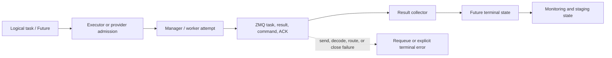
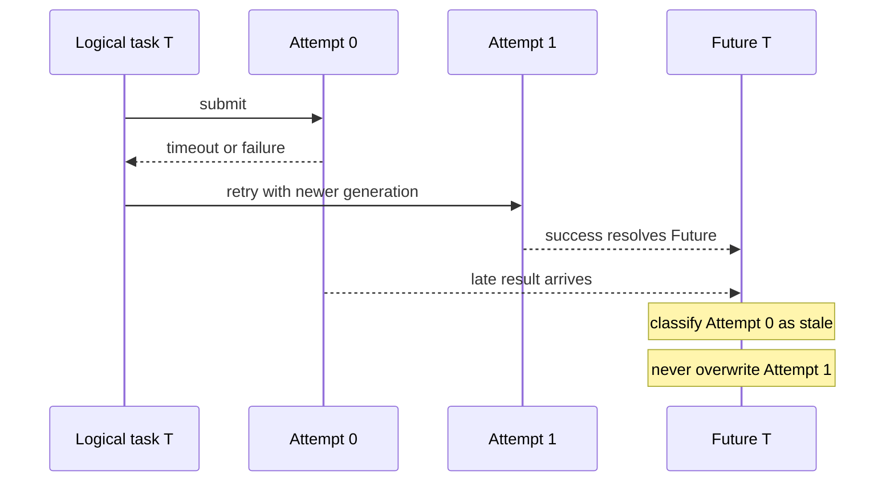
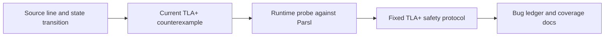
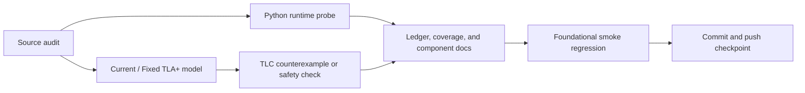

# Article and Podcast Plan

This document proposes a public explanation of the TLA+ Parsl project. It is designed to support
either a written article or a 35–45 minute technical podcast episode.

## Central story

The strongest framing is not “we found 318 confirmed Parsl bugs.” The defensible claim is:

> Can a small TLA+ model expose communication and asynchronous protocol risks in a distributed
> workflow system?

The answer is demonstrated through source review, a bounded Current counterexample, a runtime
probe, and a Fixed protocol. The number of ledger records is supporting evidence, not the story's
main result.

## Recommended article structure

1. **The problem:** workflow failures are often ownership, ordering, and terminal-state failures,
   not incorrect user-function results.
2. **Why Parsl:** one logical task can cross the DFK, executor/provider, manager/worker, ZMQ,
   result collector, Future, staging, and monitoring boundaries.
3. **The abstraction:** separate logical tasks from physical attempts and messages.
4. **A small model:** show a compact task-dispatch or stale-result TLA+ example.
5. **A counterexample:** demonstrate a failed send that leaves a task with no owner.
6. **Three evidence layers:** source transition, TLC behavior, and installed-Parsl runtime probe.
7. **What the audit found:** group risks by protocol category rather than listing every ledger row.
8. **What it does not prove:** explain bounded TLC, candidate fixes, and the distinction between a
   source-backed risk and an upstream-confirmed defect.

## Figure 1: ownership across the workflow

Suggested caption: **One logical task, several ownership boundaries.** Every arrow is a possible
place where a task can be lost, duplicated, misrouted, or made permanently non-terminal.

## Figure 2: retry and stale-result correlation

Suggested caption: **A late result is a stale attempt, not a second completion.** This is why the
model tracks physical attempt identity separately from logical task identity.

## Figure 3: evidence ladder

Suggested caption: **One finding, five artifacts.** A model is not added merely because code looks
unusual; the project requires a source location, a meaningful Current violation, a Fixed protocol,
and runtime evidence when the boundary is executable.

## Figure 4: record distribution

The canonical flat ledger contains 318 records and approximately 317 unique numeric BUG IDs.
The following assignment is a distribution of ledger records, not a measurement of defect
prevalence:

| Category | Records | Share |
| --- | ---: | ---: |
| Providers and scheduler adapters | 92 | 28.9% |
| Executors and worker lifecycle | 78 | 24.5% |
| Serialization and ZMQ transport | 53 | 16.7% |
| Monitoring and database | 32 | 10.1% |
| File staging and transfer | 29 | 9.1% |
| Clock, heartbeat, and timeout | 22 | 6.9% |
| `join_app` and memoization | 9 | 2.8% |
| Core dataflow and Future lifecycle | 3 | 0.9% |

The split ledger is synchronized with the canonical ledger in `docs/bug-ledger/index.md` and the
category README files. The numeric BUG-259 refinement is counted as a record while sharing the
original numeric identifier.

## Recommended case studies

Use three cases in the article or podcast:

### HTEX task dispatch send failure

`Interchange.process_tasks_to_send` removes a task from the pending queue before sending it to a
manager. If the ZMQ send fails, the task is no longer pending, assigned, or terminalized. The
Current model violates `NoTaskLoss`; the Fixed model retains ownership or emits an explicit
terminal transport failure.

### Stale result after retry

Attempt 0 can finish after Attempt 1 has become current. The Current protocol can resolve the old
result into the logical Future; the Fixed protocol requires both the logical task identity and the
current physical attempt generation.

### Callback mutation during failure fan-out

Work Queue, TaskVine, and provider failure paths can iterate a live task dictionary while
`Future.set_exception` synchronously executes callbacks. A callback can remove an entry and abort
the collector before independent Futures are terminalized. Snapshot-based fan-out is the candidate
safe protocol.

## Repository activity timeline

The repository history supports a project-level timeline, but it cannot reconstruct exact chat or
subagent activity: Git contains one configured author and no agent identifiers. Therefore this is
an artifact timeline, not a transcript of individual conversations.

| Phase | Evidence | Result |
| --- | --- | --- |
| Sep 28 | `64b64af`, `cf4c504` | Initial executable abstraction and English scope documentation |
| Sep 29 | Early core, transport, provider, heartbeat, and join commits | Initial model families and runtime-probe integration |
| Sep 30 | `81970cf` and cross-layer model commits | v0.1 validation report and broad composition coverage |
| Oct 1 | `ddb3aca` and related checkpoint commits | Acceptance/freeze artifacts and regression checkpoints |
| Oct 2, early | `151c9d4`, `c35512f` | Finite communication scope and explicit source inventory |
| Oct 2, late | `f352872`, `d8c145f`, `0867e0a`, `ce8f2e1`, `645b5a0` | HTEX send-failure and malformed-message refinements |
| Oct 2, publication | `d8c5c7b`, `63e640c`, `68bef09` | Validation count refresh, README findings, and project report |

The recurring workflow was:

Git-level activity also shows that the project was not only model writing: commits touched docs,
runtime probes, smoke scripts, README files, and configuration files in separate verification and
publication checkpoints. Those counts are historical repository metadata, not a reliable count of
individual agent turns.

## Podcast pacing

For a 35–45 minute episode:

- 5 minutes: Parsl and why distributed workflow state is difficult;
- 8 minutes: the task/attempt/message/Future abstraction;
- 10 minutes: walk through the task-dispatch counterexample;
- 8 minutes: explain Current, Fixed, TLC, and runtime probes;
- 5 minutes: compare the three case studies and the ledger distribution;
- 5 minutes: limitations, reproducibility, and lessons for other workflow systems.

## Claims to avoid

- “TLA+ proved Parsl is correct.”
- “The project found 318 confirmed upstream bugs.”
- “The model simulates every detail in the Parsl paper.”
- “A passing smoke run covers unbounded networks, Python heaps, or OS scheduling.”

The accurate claim is that the project provides a bounded, executable protocol audit with
source-backed risks, repeatable counterexamples, candidate safety protocols, and runtime evidence.
